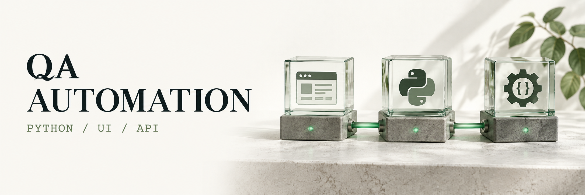

# Игорь Ниточкин

**QA Automation Engineer · Python · финтех**

Проверяю пользовательские сценарии от интерфейса до состояния данных. Пишу UI- и API-автотесты, разбираю требования и ищу проверяемое объяснение сбоев.

**[Портфолио и опыт ↗](https://igornitqa.github.io/)** · **[Резюме PDF ↓](https://igornitqa.github.io/resume.pdf)** · **[Telegram](https://t.me/i_nitochkin)**

## Что делаю

- **UI и API:** регистрация, авторизация и приглашения; pytest, Playwright, фикстуры и подготовка тестовых данных.
- **Контракты и данные:** Pydantic-модели, SQL и независимые проверки постусловий в БД.
- **Тестовая инфраструктура:** GitLab CI, Docker, uv и отчёты Allure.
- **Тест-дизайн:** требования, пограничные случаи, ошибки интеграций, повторы и восстановление.

## Кейсы из практики

| Кейс | Что внутри |
| :--- | :--- |
| [API-регресс: от ответа к состоянию в БД](https://igornitqa.github.io/cases/api-regression.html) | Одноразовые пользователи, контракты ответов, постусловия и очистка данных. |
| [AI в QA-цикле](https://igornitqa.github.io/cases/ai-in-qa.html) | Ревью требований, тест-дизайн и диагностика с проверкой выводов по источникам. |
| [Happy Path Bot](https://igornitqa.github.io/cases/happy-path-bot.html) | Черновик кейса по задаче, просмотр до записи и проверка дублей в Test IT. |

## Технологии

**Автоматизация:** Python · pytest · Playwright · Pydantic · Allure

**Данные и диагностика:** SQL · PostgreSQL · MySQL · DevTools · Postman

**Окружение и процесс:** Git · GitLab CI · Docker · uv · Test IT

## Публичный проект

**[Сайт-портфолио и его автотесты](https://github.com/IgornitQA/IgornitQA.github.io)** — статический сайт с проверками страниц, ссылок, адаптивности, доступности и PDF на pytest + Playwright.

Коммерческий код остаётся в закрытых репозиториях. На сайте — описания подходов и кейсов без внутренних адресов и данных пользователей.

---

Открыт к предложениям удалённой работы. **[Написать в Telegram](https://t.me/i_nitochkin)** · [Email](mailto:igor.nitochkin@gmail.com)
